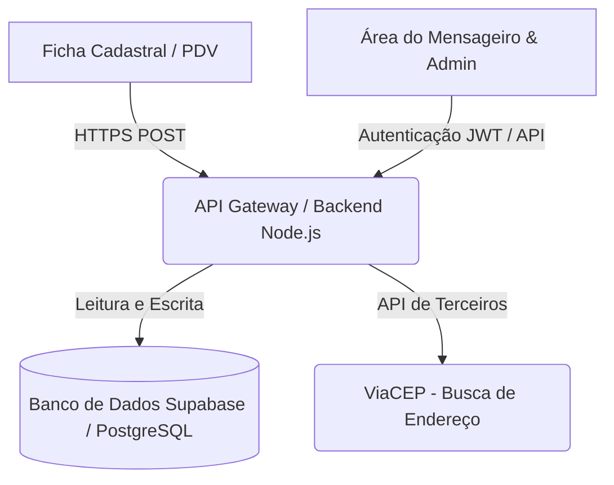
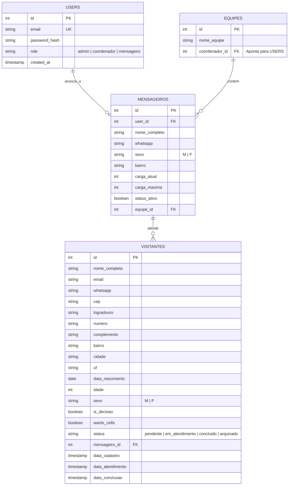
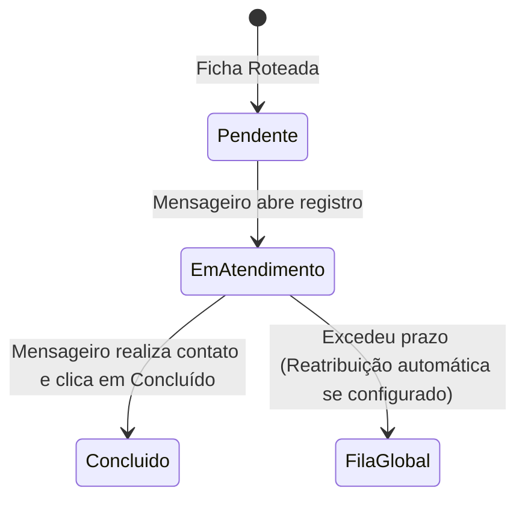
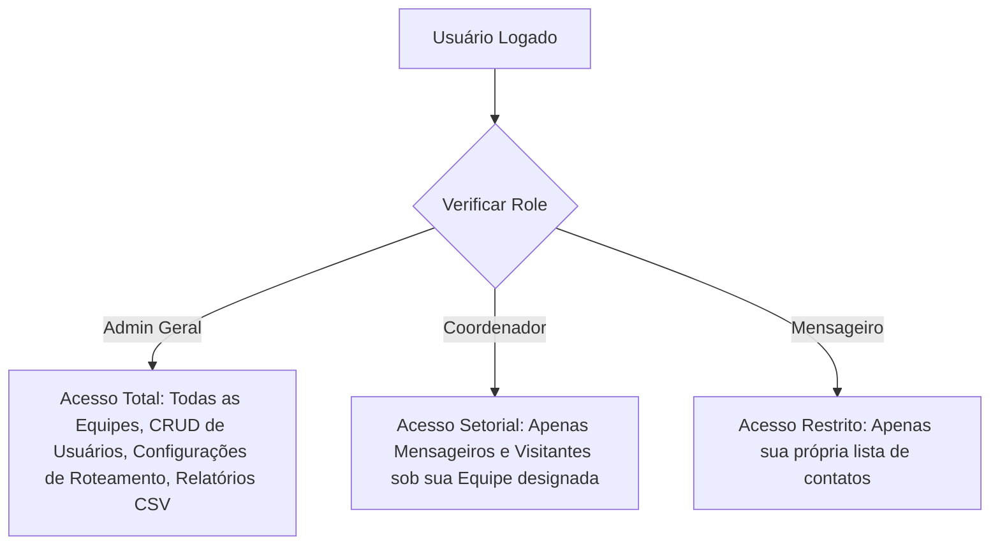
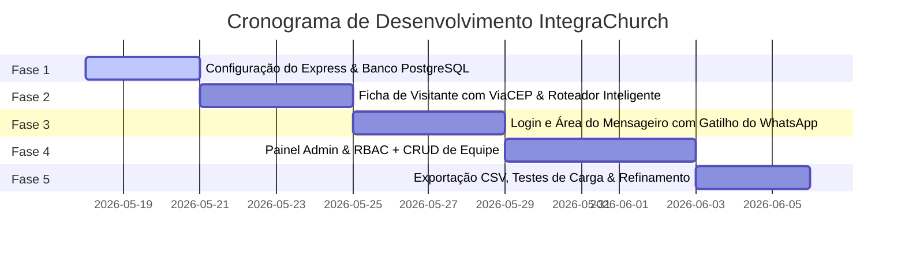

# Documento de Requisitos do Produto (PRD) — IntegraChurch

> **Versão:** 1.0  
> **Status:** Pronto para Desenvolvimento  
> **Autor:** Antigravity AI  
> **Ambiente de Destino:** Replit  
> **Idioma:** Português do Brasil (PT-BR)

---

## 1. Visão Geral do Produto

### 1.1 Contexto e Definição do Problema
Megachurches (igrejas de grande porte) enfrentam um desafio logístico crítico na recepção e consolidação de novos visitantes. Semanalmente, centenas de pessoas visitam os cultos e preenchem fichas físicas em papel ou formulários estáticos. Na maioria das vezes, devido ao volume de dados, à descentralização e à falta de acompanhamento automatizado, **essas fichas são esquecidas ou deixadas de lado**. 

Essa falha no processo de onboarding resulta em uma perda significativa de retenção de membros, enfraquece o ministério de Integração e impede que a liderança tome decisões baseadas em dados.

### 1.2 Proposta de Valor
O **IntegraChurch** é um sistema operacional web responsivo projetado especificamente para solucionar a dor do ministério de Integração. Ele **automatiza a ponte entre o visitante e o membro da igreja (Mensageiro)** de forma inteligente, garantindo que nenhum visitante fique sem contato. 

O sistema oferece:
*   **Captação Eficiente:** Formulário limpo e assistido (busca automática de CEP e cálculo de idade).
*   **Roteamento Inteligente:** Algoritmo que faz o *matching* automático entre visitante e mensageiro por proximidade geográfica, sexo, faixa etária e carga de trabalho.
*   **Controle de Supervisão:** Hierarquias claras de visualização e permissão para Coordenadores e Admins.
*   **Acompanhamento Baseado em Dados:** Dashboard com KPIs dinâmicos e relatórios analíticos completos.

---

## 2. Arquitetura de Referência e Stack Tecnológica para Replit

Para garantir uma implementação rápida, de alto desempenho e perfeitamente compatível com o ambiente do **Replit**, a seguinte stack é recomendada:

### 2.1 Detalhamento da Stack
1.  **Frontend:**
    *   HTML5 semântico estruturado.
    *   **Tailwind CSS (via CDN ou npm)** para estilização moderna com suporte a temas.
    *   **JavaScript (Vanilla ES6)** no cliente, garantindo velocidade de renderização e animações micro-interativas premium.
    *   **Chart.js** para renderização dos gráficos de KPIs nos dashboards.
2.  **Backend (Replit Node.js):**
    *   **Node.js** com **Express** como servidor HTTP e API REST.
    *   **JWT (JSON Web Tokens)** para autenticação e sessões seguras dos Mensageiros, Coordenadores e Administradores.
3.  **Banco de Dados:**
    *   **PostgreSQL** (via Supabase ou PostgreSQL integrado ao Replit) para armazenamento persistente e consultas geográficas rápidas.
    *   **LocalStorage** para sincronização offline temporária no frontend.

---

## 3. Modelo de Dados (Schema de Banco de Dados)

O modelo de dados deve ser estruturado de forma relacional para suportar o controle de cargas e atribuição dinâmica de visitantes.

---

## 4. Requisitos Funcionais Detalhados

O sistema é dividido em três frentes de atuação com escopos bem delimitados.

---

### Frente 1: Ficha Cadastral (Modo PDV / Web Responsiva)

Esta tela é a porta de entrada dos dados. Deve operar como um "Quiosque" ou "PDV" nas dependências da igreja, podendo ser preenchido por um voluntário ou pelo próprio visitante em seu celular, tablet ou desktop.

#### R.F. 1.1 — Campos Obrigatórios e Validações
*   **Nome Completo:** Texto, capitalização automática, validação de pelo menos duas palavras.
*   **E-mail:** Validação de formato de e-mail padrão.
*   **WhatsApp:** Campo com máscara dinâmica `(99) 99999-9999`. Apenas números salvos no banco.
*   **Endereço Assistido (Integração ViaCEP):**
    *   Campo CEP com máscara `99999-999`.
    *   Ao digitar o 8º caractere, o sistema faz requisição automática na API `https://viacep.com.br/ws/{cep}/json/`.
    *   Preenche automaticamente: *Rua/Logradouro, Bairro, Cidade e UF*.
    *   O foco do cursor deve ir direto para o campo *Número* após o preenchimento automático.
    *   O usuário pode editar os campos se o ViaCEP retornar dados em branco ou falhar.
*   **Data de Nascimento (Cálculo Automático de Idade):**
    *   Input de data.
    *   Cálculo em tempo real da idade e exibição de um selo visual dinâmico com a faixa etária correspondente:
        *   `0 a 11 anos` 👉 Criança
        *   `12 a 17 anos` 👉 Adolescente
        *   `18 a 29 anos` 👉 Jovem
        *   `30 a 59 anos` 👉 Adulto
        *   `60+ anos` 👉 Melhor Idade
*   **Sexo:** Opções exclusivas `Masculino` ou `Feminino`.
*   **Opções Espirituais (Checkboxes Interativos):**
    *   *“É uma ficha de decisão”* (visitante aceitou a Cristo ou se reconciliou).
    *   *“Tem desejo de participar de nossas células”* (desejo de integração em grupos pequenos).

#### R.F. 1.2 — Regras do Algoritmo de Matching e Roteamento Inteligente
Assim que o visitante clica em **Concluir Cadastro**, o backend processa o roteamento em tempo real seguindo este fluxo rigoroso de critérios:

| Ordem de Prioridade | Critério | Regra | Raciocínio |
| :--- | :--- | :--- | :--- |
| **1º Filtro** | **Sexo (Matching Obrigatório)** | Homem atende Homem (M ➔ M) e Mulher atende Mulher (F ➔ F). | Segurança ministerial e facilidade de conexão pessoal. |
| **2º Filtro** | **Carga Disponível** | O mensageiro deve estar ativo (`status_ativo = true`) e com carga menor que a máxima (`carga_atual < carga_maxima`). | Evita sobrecarga de voluntários. |
| **3º Filtro** | **Proximidade Geográfica** | Busca mensageiros residentes no mesmo `bairro` do visitante. | Facilita visitas presenciais e integração local na mesma célula territorial. |
| **4º Filtro** | **Menor Carga** | Se houver empate no bairro, ou se nenhum morar no mesmo bairro, o mensageiro com a **menor carga atual** é selecionado. | Balanceamento inteligente da equipe. |
| **Fila Global (Fallback)** | **Transbordo** | Se todos os mensageiros do sexo do visitante estiverem com carga cheia, o visitante entra no status `pendente` e aguarda alocação manual ou liberação de carga. | Nenhuma ficha é perdida. |

> [!IMPORTANT]
> A tela de sucesso para o visitante **não deve exibir os detalhes internos de alocação de mensageiro** para preservar a segurança da equipe e o fluxo operacional do ministério. Ela apenas mostra que o cadastro foi gerado com sucesso e que um contato será feito em breve.

---

### Frente 2: Área do Mensageiro

Canal seguro onde os voluntários da integração entram em contato com os visitantes atribuídos a eles e reportam o progresso à liderança.

#### R.F. 2.1 — Acesso Restrito e Login Unificado
*   A página de login é única para Mensageiro, Coordenador e Admin.
*   O sistema lê a flag `role` no login e redireciona para o painel correspondente.
*   **Restrição de Visibilidade:** A ficha cadastral/PDV pública não deve possuir nenhum link ou botão visível para esta área de login para evitar acessos indevidos.

#### R.F. 2.2 — Painel e KPIs do Mensageiro
Ao fazer login, o mensageiro visualiza:
*   **KPIs Pessoais Dinâmicos:**
    *   *Total de Atendimentos Ativos* (carga atual).
    *   *Contatos Concluídos este mês*.
    *   *Tempo médio de primeiro contato* (dias/horas).
*   **Lista de Visitantes Atribuídos (Tabela/Cards Interativos):**
    *   Mostra apenas os visitantes roteados a ele.
    *   Exibe dados rápidos: Nome, Idade, Bairro, Selo de "Decisão" ou "Desejo de Célula".
    *   Botão direto de **WhatsApp** com ícone Solar/SVG.
    *   Botão de **Concluir Atendimento**.

#### R.F. 2.3 — Ação de Contato Rápido por WhatsApp
Ao clicar no botão de WhatsApp de um visitante:
1.  O sistema abre uma nova aba com a URL de API do WhatsApp Web/Mobile preenchida:
    `https://wa.me/55{numero_whatsapp}?text={mensagem_codificada}`
2.  **Modelo de Mensagem Pronta (Template Dinâmico):**
    > *"Olá, **[Nome do Visitante]**! Tudo bem? Me chamo **[Nome do Mensageiro]** e faço parte da equipe de Integração da **[Nome da Igreja]**. Vimos que você nos fez uma visita e gostaríamos de te dar as boas-vindas oficiais! Tem algo em que possamos orar por você esta semana?"*
3.  O status do visitante muda automaticamente de `pendente` para `em_atendimento` no banco de dados.

#### R.F. 2.4 — Finalização de Atendimento
*   Após o diálogo, o mensageiro insere uma observação rápida (Ex: *"Marcou de ir na célula nesta quarta"*) e clica em **Concluir**.
*   O status vai para `concluido`, liberando uma vaga na carga do mensageiro (`carga_atual` decrementa 1 no banco).
*   Os dados e insights desta ação são sincronizados em tempo real com o Painel Admin.

---

### Frente 3: Painel Admin e Hierarquias de Permissão

Área de governança e análise estratégica do ministério. Deve possuir três níveis de acesso (RBAC):

#### R.F. 3.1 — Matriz de Permissões (RBAC)

| Funcionalidade | Administrador Geral | Coordenador de Equipe | Mensageiro Comum |
| :--- | :---: | :---: | :---: |
| **Visualizar KPIs Globais** | Sim | Apenas de sua equipe | Não |
| **Adicionar/Remover Mensageiros** | Sim | Sim (Apenas na sua equipe) | Não |
| **Criar Novos Admins/Coordenadores** | Sim | Não | Não |
| **Reatribuir Fichas Manualmente** | Sim | Sim (Dentro da sua equipe) | Não |
| **Exportar CSV Analítico** | Sim | Sim (Apenas de sua equipe) | Não |
| **Ver Prévia Inline da Tabela de Logs** | Sim | Sim | Não |

#### R.F. 3.2 — Controle e Gestão da Equipe (CRUD)
*   **Adicionar Mensageiros:** Formulário informando Nome, Sexo, WhatsApp, Bairro de Residência, Carga Máxima (default: 5) e Equipe. Cria automaticamente as credenciais de login vinculadas.
*   **Ativação/Desativação:** Toggle para ativar/desativar voluntários. Se desativado, o algoritmo de matching ignora o mensageiro imediatamente.
*   **Remoção Segura:** Ao remover um mensageiro, se houver visitantes vinculados em aberto, o sistema força o admin a reatribuir essas fichas para outro membro ativo.

#### R.F. 3.3 — KPIs Relevantes no Admin (Positivos e Negativos)
*   **KPIs Positivos:**
    *   *Taxa Geral de Conversão* (% de visitantes que concluíram o onboarding).
    *   *Volume de Fichas de Decisão* convertidas com sucesso.
    *   *Células integradas* (leads encaminhados).
*   **KPIs Negativos (Sinais de Alerta):**
    *   *Fichas Sem Contato Há Mais de 48 Horas* (gargalos).
    *   *Mensageiros Inativos ou com Cargas Saturadas* (necessidade de novos voluntários).
    *   *Taxa de Abandono* (visitantes que recusaram contato).

#### R.F. 3.4 — Visualização de Tabela Inline e Exportação (CSV)
*   **Tabela Inline Interativa:** Filtros por Data, Sexo, Bairro, Status e Tipo de Decisão. Exibe uma visualização prévia elegante com paginação.
*   **Exportação CSV:** Botão para download instantâneo de um relatório estruturado com todos os dados de contato do visitante, mensageiro responsável, datas de transição de status e feedbacks, ideal para relatórios pastorais em Excel.

---

## 5. Requisitos Não-Funcionais (RNF)

1.  **Segurança e LGPD (Lei Geral de Proteção de Dados):**
    *   Todas as senhas devem ser criptografadas no banco utilizando **bcrypt**.
    *   O painel público de cadastro não pode armazenar cookies identificáveis de outros visitantes.
    *   Restrição de visualização de dados pessoais dos visitantes: apenas mensageiros atribuídos podem ver o WhatsApp do visitante correspondente.
2.  **Design Premium e Responsividade:**
    *   Utilização estrita do design system já implementado nos arquivos locais: tipografia **Inter** e **Outfit**, cores com paleta escura elegante (Slate-950) mesclada com detalhes suaves de verde esmeralda (Emerald/Mint).
    *   A Ficha Cadastral deve ter carregamento instantâneo, adaptando-se perfeitamente de displays de smartphones antigos a tablets e computadores de recepção (PDVs).
3.  **Performance no Replit:**
    *   Consumo otimizado de banco de dados por meio de índices nas colunas `sexo`, `bairro`, `status` e `mensageiro_id`.
    *   Controle de concorrência: transações atômicas para evitar que duas fichas sejam alocadas ao mesmo mensageiro ultrapassando sua carga máxima.

---

## 6. Roteiro de Implementação Sugerido no Replit

Para programar o sistema de forma incremental no Replit, siga estas 5 fases sugeridas:

### Fase 1: Fundação do Ambiente (3 Dias)
*   Inicialização do projeto no Replit (`npm init -y`).
*   Configuração do servidor Node.js com Express e conexão com o banco (Supabase/Postgres).
*   Criação das migrações das tabelas do banco de dados (conforme item 3).

### Fase 2: Ficha Cadastral & Roteador (4 Dias)
*   Montagem do formulário utilizando o código refinado de `ficha-visitante.html`.
*   Desenvolvimento do endpoint `/api/visitantes` para receber os dados do formulário.
*   Implementação do algoritmo de *matching* inteligente no backend em Node.js.

### Fase 3: Área do Mensageiro (4 Dias)
*   Construção do login unificado e validação de tokens JWT.
*   Desenvolvimento do painel do mensageiro com a listagem dinâmica de visitantes atribuídos e botões de ação do WhatsApp.
*   Mudança de status e persistência de anotações de conversão.

### Fase 4: Painel Administrativo e Equipes (5 Dias)
*   Desenvolvimento dos middlewares de segurança para diferenciar Coordenador de Administrador.
*   Interface do CRUD de mensageiros (Adicionar, Excluir, Ativar/Desativar).
*   Visualização de tabelas e aplicação de filtros em tempo real.

### Fase 5: Relatórios e Polimento (3 Dias)
*   Desenvolvimento do gerador de arquivos CSV no backend.
*   Implementação dos gráficos de KPI usando Chart.js com base em dados consolidados.
*   Testes de concorrência e simulação de matching em massa.
